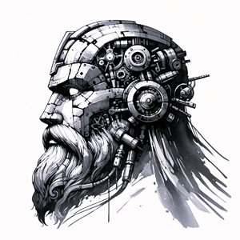

# ODIN CLI (work in progress...)
Inspired by the Norse god Odin, who was always in pursuit of knowledge and wisdom, this tool aims to enhance your capabilities by providing easy access to advanced AI-driven interactions right from your terminal.



## Table of Contents

- [Features](#features)
- [Install](#install)
- [Usage](#usage)
- [Why](#why)

## Features

### Flexible Output
Support for multiple output formats (text, YAML, JSON) for easy integration and further processing.

### Patterns
We leverage [Daniel Miessler](https://github.com/danielmiessler)'s [fabric](https://github.com/danielmiessler/fabric) project to provide
some ready to use prompts that enhance your AI interactions.

### Auto-copy to clipboard
Your last query response is automatically copied to the local clipboard, so that you're able to easily
paste it elsewhere (i.e.: your favorite note taking app).

### History
All your history (prompts and responses) are automatically saved to `~/.odincli/history/`.

## Install

### macOS
> brew install odincli

### linux
Simply copy the binary out of our releases section on this repository and add it to your `$PATH`.

## Usage
Simply access the built-in help menu to get instructions.
> odin --help

At first run, make sure you execute `odin configure` and provide your [ChatGPT API key](https://platform.openai.com/api-keys).
If you ever need to edit it, it will be saved at `~/.odincli/config`.

The simplest possible query is.
```text
$ odin "What is the meaning of life?"
The question "What is the meaning of life?" has intrigued philosophers, theologians, scientists, 
and thinkers throughout history, and it continues to be a central inquiry in the study of 
philosophy and existentialism.
...
```

## Why
Why did I create this?  
ANS.: I wanted a project that could propel me to learn to code and structure applications in Golang and at the same time produced something that I could use on my daily workflow.
Being a heavy user of `Chat GPT`, it just made sense.

## Next steps
Now that fabric is written in Golang, I might as well start contributing a Perplexity function there.
